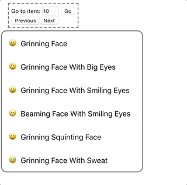

# Scrollable List

[](https://circleci.com/gh/elissaioskon/scrollable-list/tree/master)
[](https://www.npmjs.com/package/@elissaioskon/scrollable-list) 
[](https://img.shields.io/codecov/c/github/elissaioskon/scrollable-list) 
[](https://github.com/elissaioskon/scrollable-list/blob/master/LICENSE)

> Scroll to an element within a list easily 😃  

[Codesandbox example](https://codesandbox.io/s/scrollable-list-example-3id28?fontsize=14)
<br>
[](https://codesandbox.io/s/scrollable-list-example-3id28?fontsize=14) 

## Motivation

A common ui scenario is a list with some items. User should be able to move on next item in the list
on some keypress (e.g on down arrow click) and the scroll should move to that element too. 
In order to achieve that with react, a ref should be kept for every list item in order to move scroll 
to that item. This library makes this task easy to achieve. 

```jsx
import React, {useRef, useState} from 'react'

const emojis = [
  "😀 Grinning Face",
  "😃 Grinning Face With Big Eyes",
  "😄 Grinning Face With Smiling Eyes"
 ]

const App = () => {
    const ref = useRef()
    const [currentScrollIndex, setCurrentScrollIndex] = useState(0)
    
    return (
      <>
          <ScrollView ref={ref}>
              <div className="list-container">
                {emojis.map( emoji => (
                   <ScrollableElement>
                      <div className="list-item">{emoji}</div>
                   </ScrollableElement>
                ))}
              </div>
          </ScrollView>
          
         <button onClick = {()=> ref.current.scroll.toPreviousItem(currentScrollIndex, setCurrentScrollIndex)}>Scroll to Previous</button>
         <button onClick = {()=> ref.current.scroll.toNextItem(currentScrollIndex, setCurrentScrollIndex)}>Scroll to Next</button>
         <button onClick = {()=> ref.current.scroll.toIndex(5, setCurrentScrollIndex)}>Scroll to fifth Item</button>
      </>
    )
}
```

<br>

### Install

- Using yarn   
    yarn add @elissaioskon/scrollable-list
 
- Using npm   
    npm install @elissaioskon/scrollable-list 
 

### API

- [`ScrollView`](./docs/ScrollView.md) 
- [`ScrollableElement`](./docs/ScrollableElement.md) 

